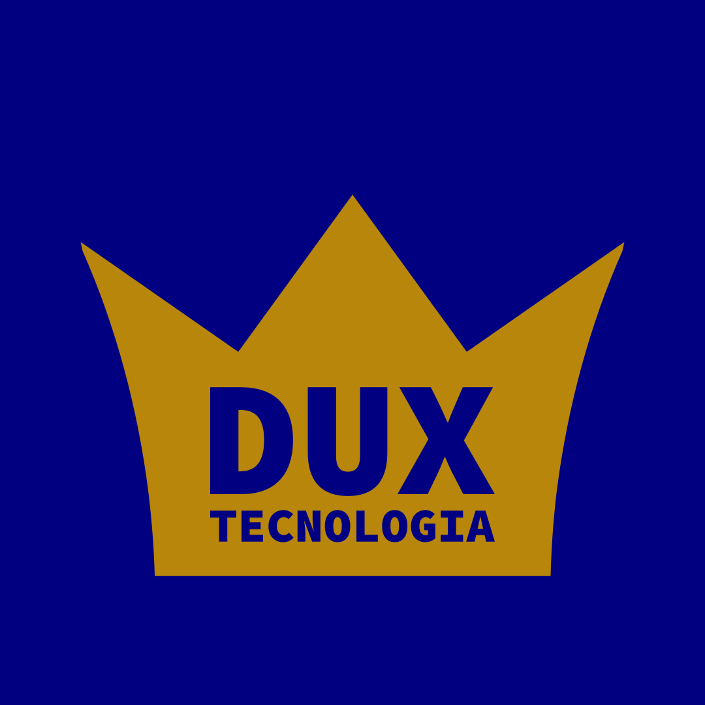

    
    

        <h1>Dux Tecnologia</h2>
        Somos uma empresa especializada no desenvolvimento de soluções inovadoras, personalizadas e eficientes, ajudando nossos clientes a transformar suas ideias em realidade digital. Atuamos em diversos segmentos, oferecendo serviços completos de desenvolvimento de software, consultoria em TI e suporte técnico especializado.
    

## Contatos

## Principais projetos

### [x] SGPC - Sistema de Gestão de Provas e Concursos
Desenvolvimento de um sistema para a Associação Brasileira de Psiquiatria (ABP), responsável pela gestão de provas e concursos, com foco no acesso de candidatos, banca e administradores, automação de processos e geração de relatórios. O sistema abrange a interposição de recursos por candidatos e sua avaliação pela banca examinadora, além de módulos administrativos robustos para visualização de dados e controle dos status de pagamentos, proporcionando uma gestão centralizada e eficiente de todo o processo.

### [x] SOS - Service Order System
Projeto para o Núcleo Interdisciplinar de Dinâmica de Fluidos (NIDF - UFRJ), consistindo em um sistema modular para a gestão de ordens de serviço, integração com bases de dados e automação de fluxos internos.

### [x] Framework ModulePHP
O Module PHP é um framework PHP modular que segue as melhores práticas e incorpora tecnologias avançadas para o desenvolvimento web. Ele foi desenvolvido com o objetivo de oferecer uma estrutura flexível e eficiente para a criação de aplicativos web robustos e escaláveis, focando especialmente na criação de aplicativos web com múltiplos níveis de usuário.

### [x] TDSEA - Twitter Data Search and Extract App
Projeto desenvolvido para o Laboratório Espaço - IPPUR - UFRJ,focado na extração, processamento, análise e representação de dados do Twitter de diversas fontes como Facebook, Twitter, portais de notícias, com flexibilidade para expansão das fontes de dados.

### [x] Automação de Processos no Laboratório Espaço - UFRJ
Automação de processos em ambiente de laboratório para otimização do fluxo de trabalho acadêmico.

### [x] Bibliotecas educacionais Píton e BRScript
Píton e BRScript são bibliotecas irmãs voltadas para uso educacional, com foco no ensino de Python e Javascript mas totalmente em português, tornando o aprendizado de algoritmos e lógica de programação mais acessível e amigável para falantes da língua portuguesa.

### [x] SOAD - Sistema de Operações Avançadas com Dados
Sistema modular em Python que realiza a extração, tratamento, processamento e representação de dados de diversas fontes. Utilizado em ambientes de laboratório, com módulos dedicados para Gephi, Twitter, portais de notícias e visualização de dados em tabelas e Wordclouds.

### [x] CertificateBuilder
Ferramenta desenvolvida para automatizar a criação de certificados em lote utilizando Python, pandas e reportlab, agilizando a geração e personalização de documentos.

## Tecnologias utilizadas

Trabalhamos com uma ampla gama de tecnologias para desenvolver soluções robustas e eficientes:

### Backend

- #### **Linguagens de Programação:**

- #### **Frameworks:**

- #### **Bibliotecas:**

### Frontend

### Dados

### Testes

### DevOps

### Design

### Outras ferramentas

### Metodologias ágeis

